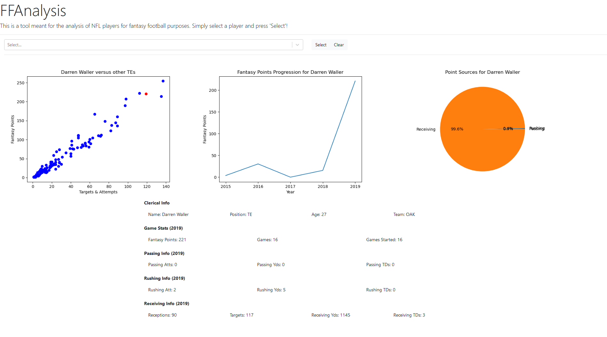

## Description

FFAnalysis is a web app intended to help users determine which NFL players they should start when playing Fantasy Football. This is achieved by looking at player stats from previous years, as well as displaying a certain player's stats in context to other players of the same position. These stats consist of both numerical stats, as well as graphical analysis. FFAnalysis was written in JavaScript and Python, along with React, Bootstrap, and Flask.

## Running the Web App

To run this project, navigate to the api directory, and run 'python api.py' in console. This starts the REST API server. Then, to run the web page, run 'npm start' or 'npm run build' in console. Then, navigate to http://localhost:3000 to view the web app.